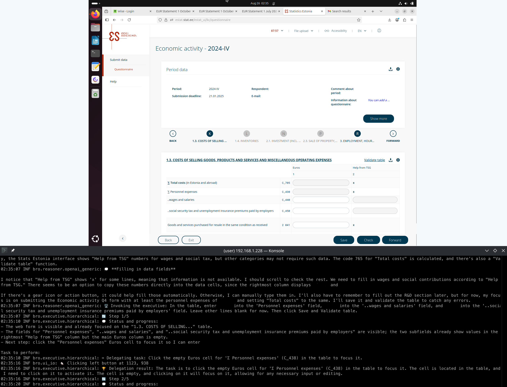

<h1 align="center" style="text-align:center">Bro 🤖</h1>
<p align="center" style="text-align:center">The Practical Business Operations Robot</p>
<div align="center">

[](https://forum.zubax.com)

</div>
<hr/>

Bro is an LLM computer-using agent (CUA) designed to autonomously perform mundane tasks related to business operations
and administration, such as doing accounting, filing paperwork, and submitting applications.

ℹ️ *"Bro" is Latvian for "one who beheads the Messiah".*

⚠️ **Bro is currently under active development and is known to contain bugs.**
However, it already useful and can be applied to low-stakes open-ended real-world tasks ---
which we already practice at Zubax with varying degrees of success.

Currently, Bro utilizes the general-purpose GPT-5 for high-level reasoning and planning,
a fast GPT-5-Mini with a low reasoning effort setting for low-level UI control,
and the fast and compact UI-TARS-1.5-7B for UI grounding
(which is used directly, without any additional OCR or object detection).
The agent is tuned to avoid touching UI unless absolutely necessary, preferring
direct file access, shell commands, and hotkeys whenever possible.

There is an option to replace the GPT-5-Mini & UI-TARS stack with the stock CUA model from OpenAI,
but this is actually not recommended because it is slower and much more expensive than the UI-TARS stack.

You can even run UI-TARS locally (the 7B version only needs 32 GB of VRAM) and avoid OpenRouter.
Warning though: **quantized edits of UI-TARS cannot be used for grounding as-is!!**
The exact reasons for that elude my understanding, but quantized models tend to predict screen coordinates incorrectly
(custom scaling factors are required).

Bro does not (currently) attempt to compete in the standard CUA benchmarks because it is primarily focused
on practical utility in real-world office tasks rather than synthetic benchmarks.
As an example where the two are at odds, Bro is able to log into a bank account using 2FA OTP codes generated
by an authenticator app, while the current OSWorld flagman is too slow to succeed at that (OTP codes expire quickly);
also, Bro tends to be very cheap to run because it heavily relies on low-cost models and minimal UI interactions.



## Requirements

Currently, Bro uses OpenRouter and OpenAI for inference. You must have valid API keys for both services
exported as environment variables `OPENROUTER_API_KEY` and `OPENAI_API_KEY`.
In the future we may add other models and other inference backends.

Bro has only been tested on GNU/Linux distributions so far. Adding support for macOS and Windows should be trivial
and contributions are welcome.

⚠️ Bro can only work with single-monitor setups with the resolution at most 1920x1080.
We mostly use it in an Ubuntu virtual machine with a 1600x1200 screen resolution.
It is highly advised to use the default UI theme and a highly textured wallpaper
to avoid confusing the UI grounding model (e.g., a solid black desktop background is known to cause significant issues).

## Installation

```bash
git clone https://github.com/Zubax/bro
cd bro
pip install -e .
```

## Usage

Currently, we only provide a very rudimentary CLI interface. We are going to provide proper integrations with
messaging services like Slack, email, and Telegram in the future, so that you could leave Bro running in the
background and just send it tasks as messages, like you would with a fleshy team member.

At the moment, you invoke Bro as follows:

```bash
bro path1 path2 ...
```

Where the paths point to files or directories containing files, among which there must be exactly one file named
`prompt.txt` which contains the description of the task to perform.
You can find examples under the `demo_prompts/` directory.

Currently, the recommended practice is to give Bro a separate virtual machine with the most recent Ubuntu LTS,
configure a narrow screen resolution, ssh there and run Bro, possibly in a terminal multiplexer like tmux or screen.

To run Bro via SSH, be sure to `source source_ssh.sh` first.

## Testing

To invoke a particular component for testing purposes, go like `python3 -m bro.executive`.

## Contributing

Please open a ticket or shoot us a msg on the Zubax forum.
Pull requests are welcome.
