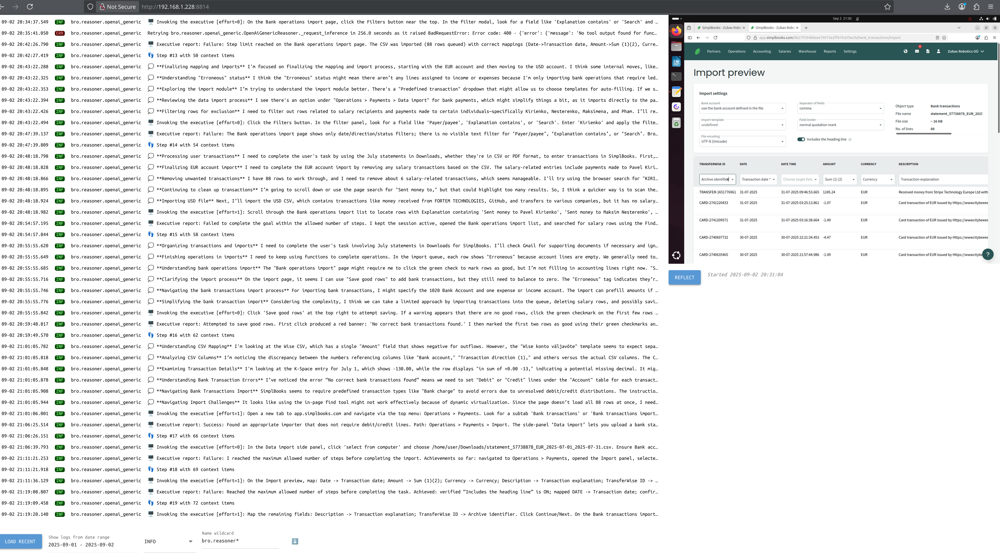

<h1 align="center" style="text-align:center">Bro 🤖</h1>
<p align="center" style="text-align:center">The Practical Business Operations Robot</p>
<div align="center">

[](https://forum.zubax.com)

</div>
<hr/>

Bro is an LLM computer-using agent (CUA) designed to autonomously perform mundane tasks related to business operations
and administration, such as doing accounting, filing paperwork, and submitting applications.
Bro is primarily designed to run on a dedicated VM or a spare laptop;
it runs as a headless process and offers a remotely accessible web interface for monitoring and control.

ℹ️ *"Bro" is Latvian for "one who beheads the Messiah".*



⚠️ **Bro is currently under active development and is known to contain bugs.**
However, it already useful and can be applied to low-stakes open-ended real-world tasks ---
which we already practice at Zubax with varying degrees of success.

Currently, Bro utilizes the general-purpose GPT-5 for high-level reasoning and planning,
GPT-5(-mini) with auto-adjusted reasoning effort setting for GUI manipulation,
and the fast and compact UI-TARS-1.5-7B for UI grounding
(which is used directly, without any additional OCR or object detection).
The agent is tuned to avoid touching UI unless absolutely necessary, preferring
direct file access, shell commands, Python scripting, and hotkeys whenever possible.

There is an option to replace the GPT & UI-TARS stack with the stock CUA model from OpenAI,
but this is actually not recommended because it is slower and much more expensive than the UI-TARS stack.

You can even run UI-TARS locally (the 7B version only needs 32 GB of VRAM) and avoid OpenRouter.
Warning though: **quantized edits of UI-TARS cannot be used for grounding as-is!!**
The exact reasons for that elude my understanding, but quantized models tend to predict screen coordinates incorrectly
(custom scaling factors are required).

Bro does not attempt to compete in the standard CUA benchmarks because it is primarily focused
on practical utility in real-world office tasks rather than synthetic benchmarks.
As an example where the two are at odds, Bro is able to log into a bank account using 2FA OTP codes generated
by an authenticator app, while the current OSWorld flagman is too slow to succeed at that (OTP codes expire quickly);
also, Bro tends to be very cheap to run because it heavily relies on low-cost models and minimal UI interactions.


## Requirements

Currently, Bro uses OpenRouter and OpenAI for inference. You must have valid API keys for both services
exported as environment variables `OPENROUTER_API_KEY` and `OPENAI_API_KEY`.
In the future we may add other models and other inference backends.

Bro has only been tested on GNU/Linux distributions so far with X11 (Wayland may not work).
Adding support for macOS and Windows should be trivial  and contributions are welcome.

⚠️ Bro can only work with single-monitor setups with the resolution at most 1920x1080.
We mostly use it in an Ubuntu virtual machine with a 1280x1024 screen resolution.
It is highly advised to use the default UI theme and a highly textured wallpaper
to avoid confusing the UI grounding model (e.g., a solid black desktop background is known to cause issues).
Disable spell checking everywhere. Disable popups. Ensure scroll bars are always visible.
Use light themes everywhere. Disable tools that inject context menus, like the ChatGPT integration in Firefox,
Grammarly, etc.

## Installation

```bash
git clone https://github.com/Zubax/bro
cd bro
pip install -e .
```

## Usage

### Command-line interface

To invoke Bro, go like:

```bash
bro --exe gpt-5+ui-tars-7b
```

For other options, see `bro --help`.
If you want to resume a previous session, use `bro --resume`.
To run Bro via SSH, be sure to `source source_ssh.sh` first,
and consider using [tmux](https://en.wikipedia.org/wiki/Tmux) as explained below.

If provided, Bro will read `~/bro/system_prompt.txt` and add the contents to the system prompt
after its internal system prompt. Use this to describe the operational environment (e.g., where to find certain files,
what software and online services to use, etc), how the bot should self-identify, its personality traits, and so on.
Bro will store some context files under the local brodir `$PWD/bro/`.
It is by design that if you clone Bro into your `~` and run it there, all three directories --
the local context directory, the global brodir, and the source directory -- will be the same.

The recommended practice is to give Bro a separate virtual machine or a spare laptop
with the most recent Ubuntu LTS, configure a narrow screen resolution (not larger than about 1600x1200),
disable Wayland, ssh there and run Bro in a terminal multiplexer.
Do not attempt to run Bro on computers used by humans.

It may be a good idea to set up the shell on the remote machine to automatically run ssh sessions in tmux
to retain Bro sessions across disconnects.
[One standard recipe is to add the following to `~/.bashrc` or `~/.profile`](https://stackoverflow.com/a/40192494/1007777):

```bash
if [[ $- =~ i ]] && [[ -z "$TMUX" ]] && [[ -n "$SSH_TTY" ]]; then
  tmux attach-session -t ssh_tmux || tmux new-session -s ssh_tmux
fi
```

To detach from a tmux session, press `Ctrl+B` followed by `D`. This will leave the session running in the background.
To reattach to the session later, use the command `tmux attach-session -t ssh_tmux`.

### Web interface

The web interface is intended for monitoring purposes only. It is available via `http://<host>:8814`.

### Instant messaging connectors

This is intended to be the main use case, but it is not implemented yet.

## Testing

To invoke a particular component for testing purposes, go like `python3 -m bro.executive.ui_tars_7b`.

## Contributing

Please open a ticket or shoot us a msg on the Zubax forum.
Pull requests are welcome.
