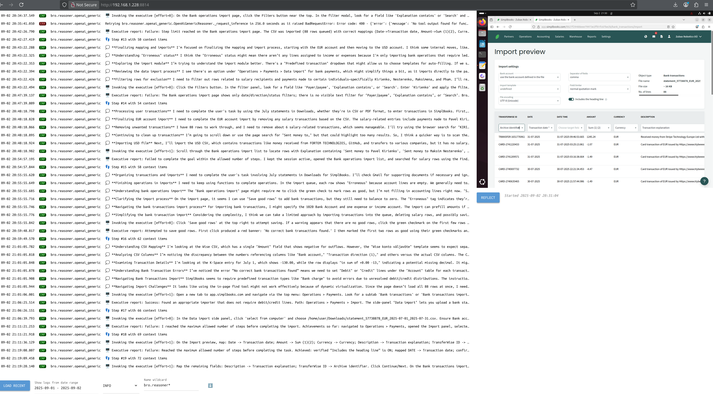
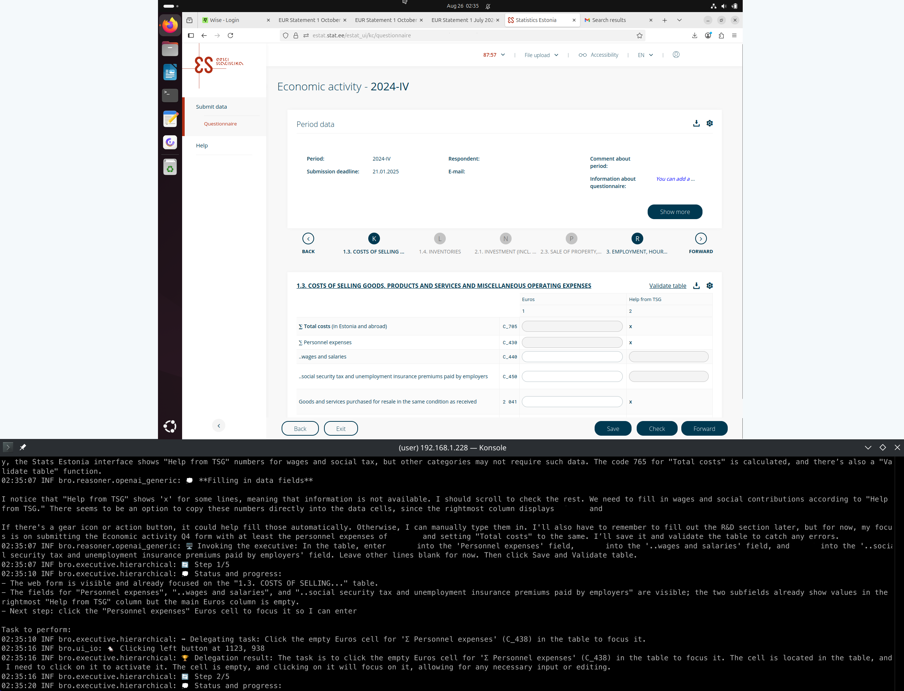

<h1 align="center" style="text-align:center">Bro 🤖</h1>
<p align="center" style="text-align:center">The Practical Business Operations Robot</p>
<div align="center">

[](https://forum.zubax.com)

</div>
<hr/>

Bro is an LLM computer-using agent (CUA) designed to autonomously perform mundane tasks related to business operations
and administration, such as doing accounting, filing paperwork, and submitting applications.
Bro is primarily designed to run on a dedicated VM or a spare laptop;
it runs as a headless process and offers a remotely accessible web interface for monitoring and control.

ℹ️ _"Bro" is Latvian for "one who beheads the Messiah"._



⚠️ **Bro is currently under active development and is known to contain bugs.**
However, it already useful and can be applied to low-stakes open-ended real-world tasks ---
which we already practice at Zubax with varying degrees of success.

Currently, Bro utilizes the general-purpose GPT-5 for high-level reasoning and planning,
GPT-5(-mini) with auto-adjusted reasoning effort setting for GUI manipulation,
and the fast and compact UI-TARS-1.5-7B for UI grounding
(which is used directly, without any additional OCR or object detection).
The agent is tuned to avoid touching UI unless absolutely necessary, preferring
direct file access, shell commands, Python scripting, and hotkeys whenever possible.
There is an option to replace the GPT & UI-TARS stack with the stock CUA model from OpenAI;
it may perform better in certain scenarios, but it is also much more expensive to run.

You can even run UI-TARS locally (the 7B version only needs 32 GB of VRAM) and avoid OpenRouter.
Warning though: **quantized edits of UI-TARS cannot be used for grounding as-is!!**
The exact reasons for that elude my understanding, but quantized models tend to predict screen coordinates incorrectly
(custom scaling factors are required).

Bro does not attempt to compete in the standard CUA benchmarks because it is primarily focused
on practical utility in real-world office tasks rather than synthetic benchmarks.
As an example where the two are at odds, Bro is able to log into a bank account using 2FA OTP codes generated
by an authenticator app, while the current OSWorld flagman is too slow to succeed at that (OTP codes expire quickly);
also, Bro tends to be very cheap to run because it heavily relies on low-cost models and minimal UI interactions.



## Requirements

Currently, Bro uses OpenRouter and OpenAI for inference. You must have valid API keys for both services
exported as environment variables `OPENROUTER_API_KEY` and `OPENAI_API_KEY`.
In the future we may add other models and other inference backends.

Bro has only been tested on GNU/Linux distributions so far with X11 (Wayland may not work).
Adding support for macOS and Windows should be trivial and contributions are welcome.

⚠️ Bro can only work with single-monitor setups with the resolution at most 1920x1080.
We mostly use it in an Ubuntu virtual machine with a 1280x1024 screen resolution.
It is highly advised to use the default UI theme and a highly textured wallpaper
to avoid confusing the UI grounding model (e.g., a solid black desktop background is known to cause issues).
Disable spell checking everywhere. Disable popups. Ensure scroll bars are always visible.
Use light themes everywhere. Disable the automatic translation suggestions in browsers.
Disable tools that inject context menus, like the ChatGPT integration in Firefox, Grammarly, etc.

## Installation

```bash
git clone https://github.com/Zubax/bro
cd bro
pip install -e .
```

## Usage

### Command-line interface

To invoke Bro, export `OPENAI_API_KEY` and `OPENROUTER_API_KEY`, then go like:

```bash
bro --exe gpt-5+ui-tars-7b
```

For other options, see `bro --help`.
If you want to resume a previous session, use `bro --resume`.
To run Bro via SSH, be sure to `source source_ssh.sh` first,
and consider using [tmux](https://en.wikipedia.org/wiki/Tmux) as explained below.

If provided, Bro will read `~/bro/system_prompt.txt` and add the contents to the system prompt
after its internal system prompt. Use this to describe the operational environment (e.g., where to find certain files,
what software and online services to use, etc), how the bot should self-identify, its personality traits, and so on.
Bro will store some context files under the local brodir `$PWD/bro/`.
It is by design that if you clone Bro into your `~` and run it there, all three directories --
the local context directory, the global brodir, and the source directory -- will be the same.

The recommended practice is to give Bro a separate virtual machine or a spare laptop
with the most recent Ubuntu LTS, configure a narrow screen resolution (not larger than about 1600x1200),
disable Wayland, ssh there and run Bro in a terminal multiplexer.
Do not attempt to run Bro on computers used by humans.

It may be a good idea to set up the shell on the remote machine to automatically run ssh sessions in tmux
to retain Bro sessions across disconnects.
[One standard recipe is to add the following to `~/.bashrc` or `~/.profile`](https://stackoverflow.com/a/40192494/1007777):

```bash
if [[ $- =~ i ]] && [[ -z "$TMUX" ]] && [[ -n "$SSH_TTY" ]]; then
  tmux attach-session -t ssh_tmux || tmux new-session -s ssh_tmux
fi
```

To detach from a tmux session, press `Ctrl+B` followed by `D`. This will leave the session running in the background.
To reattach to the session later, use the command `tmux attach-session -t ssh_tmux`.

### Web interface

The web interface is intended for monitoring purposes only. It is available via `http://<host>:8814`.

### Slack connector

Create a Slack app at https://api.slack.com/apps and configure:

1. **Socket Mode**: Enable and generate app-level token (`connections:write` scope) → `BRO_SLACK_APP_TOKEN`

2. **OAuth & Permissions**: Add bot token scopes:
   - `channels:history`, `channels:read`, `chat:write`
   - `files:read`, `files:write`
   - `groups:history`, `groups:read`
   - `im:history`, `im:read`, `im:write`
   - `mpim:history`, `mpim:read`
   - `users:read`

   Install to workspace → `BRO_SLACK_BOT_TOKEN`

3. **Event Subscriptions**: Enable and subscribe to:
   - `message.channels`, `message.groups`, `message.im`, `message.mpim`

4. **Bot User ID**: View bot profile → Copy member ID → `BRO_SLACK_USER_ID`

5. **Invite bot**: `/invite @Bro` in channels

**Environment variables:**

```bash
export BRO_SLACK_BOT_TOKEN="xoxb-..."
export BRO_SLACK_APP_TOKEN="xapp-..."
export BRO_SLACK_USER_ID="U..."
```

### Wiki.js integration

Bro can access and search any Wiki.js instance to retrieve documentation and knowledge base articles.

#### Setting up Wiki.js access

1. **Generate an API token in your Wiki.js instance**
   - Log into your Wiki.js admin panel
   - Navigate to "API Access" or "Authentication" settings
   - Create a new API key with read permissions
   - Copy the generated token

2. **Configure environment variables**

   ```bash
   export BRO_WIKI_API_TOKEN="your-api-token-here"
   export BRO_WIKI_URL="https://your-wiki-instance.com"  # Optional, defaults to https://wiki.zubax.com
   ```

   If `BRO_WIKI_URL` is not set, Bro will default to `https://wiki.zubax.com` for backward compatibility.

3. **Start Bro**
   ```bash
   bro --exe gpt-5+ui-tars-7b
   ```

Once configured, Bro will be able to search and fetch pages from your Wiki.js instance to answer questions
and retrieve documentation during task execution.

### Google Workspace integration

Bro can access Google Workspace services (Gmail, Drive, Sheets, etc.) through MCP.

**Setup:**

1. Create OAuth 2.0 credentials in Google Cloud Console:
   - Create a project or use an existing one
   - Enable required APIs (Gmail API, Drive API, etc.)
   - Create OAuth 2.0 Client ID (Desktop Application type)
   - Download the credentials

2. Set environment variables:

```bash
export GOOGLE_OAUTH_CLIENT_ID="your-client-id.apps.googleusercontent.com"
export GOOGLE_OAUTH_CLIENT_SECRET="your-client-secret"
export GOOGLE_MCP_CREDENTIALS_DIR="$HOME/.google_workspace_mcp/credentials"
export USER_GOOGLE_EMAIL="your-email@example.com"
```

**Example Email Management Workflow:**

You can add custom email handling workflows to `~/bro/system_prompt.txt`. Here's an example:

````
EMAIL_MANAGEMENT_WORKFLOW:
When checking emails, categorize and handle them as follows:

1. Promotional emails, bills, invoices, receipts:
   - Mark as read: modify_gmail_message_labels with {"remove_label_names": ["UNREAD"]}
   - No further action needed

2. Customer inquiry emails:
   - Use get_gmail_message_content to read the full email content
   - If order-related (customer mentions order number), use Shopify tools to lookup order details
   - Post to the appropriate Slack channel using this template:

\```
via: "<channel-name>"
user: "Bro"
attachments: []
---
📧 Customer email needs response

*Customer:* <customer name> (<company name if available>)

*Question:* <paste customer's question verbatim>

*Order Details:* (only if order-related, otherwise omit this section)
- Order: #<order_number>
- Date: <order_date>
- Items: <item1>, <item2>

What should I tell the customer?
\```

   - Wait for team response with the answer
   - Send the email using send_gmail_message
   - Mark as read: modify_gmail_message_labels with {"remove_label_names": ["UNREAD"]}

IMPORTANT:
- Handle email workflows yourself using Gmail MCP tools. Do NOT delegate to reasoner.
- ALWAYS ask team for the answer before responding to customers
- Only include order details if the inquiry is order-related
- Keep order details minimal: order number, date, and items only
````

### Shopify integration

Bro can access Shopify Admin API through MCP for managing products, orders, customers, and inventory.

**Setup:**

```bash
# Install MCP server
npm install -g @akson/mcp-shopify

# Get access token via OAuth
curl -X POST "https://YOUR_STORE.myshopify.com/admin/oauth/access_token" \
  -H "Content-Type: application/x-www-form-urlencoded" \
  -d "grant_type=client_credentials" \
  -d "client_id=YOUR_CLIENT_ID" \
  -d "client_secret=YOUR_CLIENT_SECRET"

# Set environment variables
export SHOPIFY_ACCESS_TOKEN="shpat_..."
export SHOPIFY_DOMAIN="your-store.myshopify.com"
```

## Testing

To invoke a particular component for testing purposes, go like `python3 -m bro.executive.ui_tars_7b`.

## Contributing

Please open a ticket or shoot us a msg on the Zubax forum.
Pull requests are welcome.
